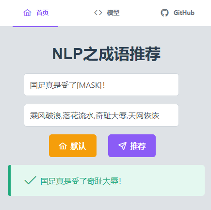
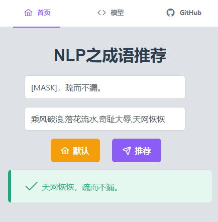

# bert-chinese-idioms

A Chinese idiom recommendation system based on BERT pre-training language model.

[Model](https://huggingface.co/mmdjiji/bert-chinese-idioms) | [Dataset](https://huggingface.co/datasets/mmdjiji/bert-chinese-idioms) | [Docker Hub](https://hub.docker.com/r/mmdjiji/bert-chinese-idioms)

## Use
Django + Vue3 + PrimeVue + Vite + Docker + GitHub Actions CI/CD

## Examples





## Docker
```bash
$ docker run -itd --name=bert-chinese-idioms -p 8000:8000 mmdjiji/bert-chinese-idioms:latest
```
**If you want build your own docker image:**

When the container is created, the model will be downloaded from huggingface automatically. If you want to download model manually, you can download it [here](https://github.com/mmdjiji/bert-chinese-idioms/releases/download/v0.1.1/bert.zip) and then put it into `model/bert`, and modify `app/bert.py#L6` to:
```py
bert_path = 'model/bert'
```
Then run the following command to build the image manually (you can modify this file with appropriate value):
```bash
$ ./build.sh
```

## Problems

- [ ] The efficiency of sentence processing is not very high
- [ ] Model accuracy is not high

## Dev (django)
```bash
$ python manage.py runserver 0.0.0.0:8000
```

## License
[GPLv3.0](https://choosealicense.com/licenses/gpl-3.0/)